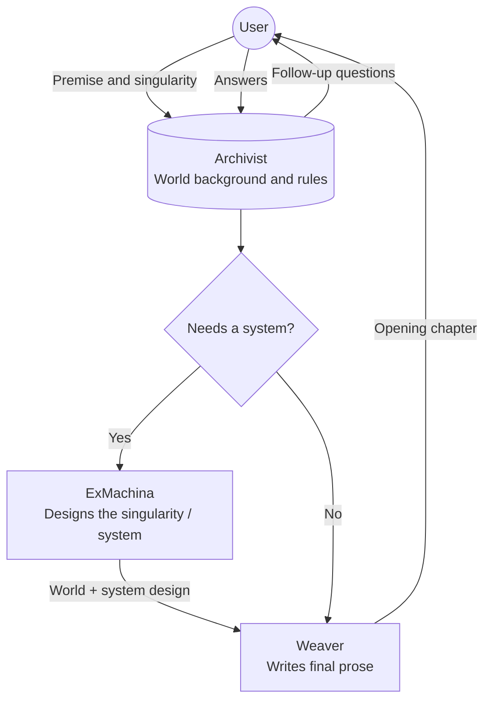
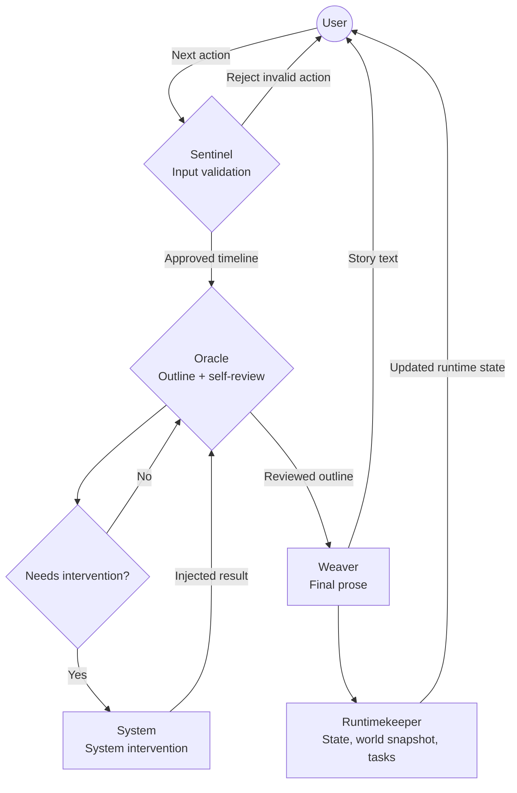

# Planb

[中文文档](./README.zh.md)

Planb is an AI-driven interactive storytelling system. It combines a full-stack Next.js app with a Markdown-configured multi-agent runtime, turning a short premise and a story singularity into an ongoing narrative with state, tasks, and AI-generated prose.

> Status: active prototype, released under the MIT License.

## Features

- **Multi-agent story orchestration**: Archivist, Sentinel, Oracle, Weaver, ExMachina, System, and Runtimekeeper collaborate across story creation and continuation.
- **Markdown-first agent configuration**: agent identities and prompts live in `planb/agents/*.md`, making behavior easy to inspect and tune.
- **Streaming AI generation**: powered by Vercel AI SDK 6 with tool calling and shared turn context.
- **Interactive story workspace**: chat, story creation form, guided follow-up questions, and markdown rendering.
- **Runtime inspector**: protagonist stats, world snapshots, task state, and token usage are visible in the right sidebar.
- **GitHub OAuth login**: Better Auth + Drizzle ORM + SQLite.
- **Bun-first development**: Bun runtime, Next.js 16, React 19, Tailwind CSS v4, shadcn/ui.

## Screenshots

| Home                                         | Create story                                               |
| -------------------------------------------- | ---------------------------------------------------------- |
|  |  |

| Story workspace                                             |
| ----------------------------------------------------------- |
|  |

## Getting started

### Prerequisites

- [Bun](https://bun.sh/) 1.x+
- A GitHub OAuth application
- An OpenAI-compatible LLM provider or another provider supported by the configured AI SDK adapter

### Install

```bash
bun install
```

### Configure environment variables

```bash
cp .env.example .env
```

Fill in `.env`:

| Variable               | Description                                                                    |
| ---------------------- | ------------------------------------------------------------------------------ |
| `DB_FILE_NAME`         | SQLite database file path, for example `planb.sqlite`.                         |
| `PLANB_SETTINGS_PATH`  | Path to the Planb LLM settings file, usually `planb.yml`.                      |
| `HOST`                 | App origin used by Better Auth callbacks, for example `http://localhost:3000`. |
| `BETTER_AUTH_SECRET`   | Secret used by Better Auth. Generate a strong random value.                    |
| `GITHUB_CLIENT_ID`     | GitHub OAuth client ID.                                                        |
| `GITHUB_CLIENT_SECRET` | GitHub OAuth client secret.                                                    |
| `LOG_LEVEL`            | Logger level, for example `debug` or `info`.                                   |
| `LLM_AGENT_LOG_DETAIL` | Agent log detail level: `summary` or `full`.                                   |

Do not commit real `.env` values.

### Configure LLM providers

```bash
cp planb.example.yml planb.yml
```

`planb.yml` controls which LLM providers and models the agent runtime can use. The file is loaded from `PLANB_SETTINGS_PATH` and defaults to `planb.yml`.

Minimal configuration:

```yaml
primaryModel: "myprovider/my-model-name"
secondaryModel: "myprovider/my-fast-model"
provider:
  myprovider:
    npm: "@ai-sdk/openai-compatible"
    name: My AI Provider
    options:
      apiKey: "replace-with-your-key"
      baseURL: "https://api.myprovider.com/v1"
    models:
      my-model-name:
        name: My Model Display Name
      my-fast-model:
        name: My Fast Model Display Name
```

Key rules:

- `primaryModel` is the default model for agents whose frontmatter says `model: primary`, or when no model is specified.
- `secondaryModel` is optional and is used by agents whose frontmatter says `model: secondary`.
- Model IDs must use `providerKey/modelName`, where `providerKey` matches a key under `provider`, and `modelName` matches a key under `provider.<key>.models`.
- `provider.<key>.name` is a display name used by logs, errors, and the OpenAI-compatible adapter.
- `provider.<key>.options.apiKey` stores the provider API key. Do not commit real keys.
- `provider.<key>.options.baseURL` is used by `@ai-sdk/openai-compatible`; `@ai-sdk/deepseek` uses the official DeepSeek endpoint instead.
- `provider.<key>.models` is the allowlist of model names available through that provider.

Supported provider packages:

| `npm` value | Package | Use case |
| --- | --- | --- |
| `@ai-sdk/openai-compatible` | `@ai-sdk/openai-compatible` | Recommended for OpenAI-compatible endpoints: OpenAI, OpenRouter, SiliconFlow, Together, Groq, vLLM, Ollama `/v1`, Volcano Ark, and similar gateways. |
| `@ai-sdk/deepseek` | `@ai-sdk/deepseek` | DeepSeek official provider with DeepSeek-specific reasoning options. |
| `ai/test` | `ai` | Test-only mock provider; useful for local tests and CI without real API keys. |

Other native AI SDK providers, such as `@ai-sdk/anthropic`, `@ai-sdk/google`, `@ai-sdk/openai`, `@ai-sdk/xai`, or `@ai-sdk/mistral`, are not enabled yet. To add one, install the package, add it to the provider whitelist in `lib/llm/type.ts`, add a dispatch branch in `lib/llm/provider.ts`, and wire provider-specific reasoning options in `lib/llm/agent.ts` if needed.

OpenAI-compatible example:

```yaml
primaryModel: "openai/gpt-4o"
secondaryModel: "openai/gpt-4o-mini"
provider:
  openai:
    npm: "@ai-sdk/openai-compatible"
    name: OpenAI
    options:
      apiKey: "replace-with-your-key"
      baseURL: "https://api.openai.com/v1"
    models:
      gpt-4o:
        name: GPT-4o
      gpt-4o-mini:
        name: GPT-4o Mini
```

DeepSeek example:

```yaml
primaryModel: "deepseek/deepseek-chat"
secondaryModel: "deepseek/deepseek-reasoner"
provider:
  deepseek:
    npm: "@ai-sdk/deepseek"
    name: DeepSeek
    options:
      apiKey: "replace-with-your-key"
    models:
      deepseek-chat:
        name: DeepSeek Chat
      deepseek-reasoner:
        name: DeepSeek Reasoner
```

Advanced usage:

- Agent frontmatter can bypass the two model slots by using a full model ID, for example `model: "openai/gpt-4o"`.
- The YAML file is read and validated during server startup. Invalid YAML, unknown `npm` values, missing provider keys, or missing model names will stop the server early with a configuration error.
- API keys live in `planb.yml`; app/auth settings live in `.env`.

### Prepare the database

```bash
bun run db:migrate
```

### Run locally

```bash
bun run dev
```

Open [http://localhost:3000](http://localhost:3000). After GitHub login, the app redirects to `/story`.

### Run with Docker Compose

Use [`docker-compose.yml`](./docker-compose.yml) as a self-hosting template:

```bash
cp planb.example.yml planb.yml
docker compose up -d
```

Before starting, set real values for `BETTER_AUTH_SECRET`, `GITHUB_CLIENT_ID`, and `GITHUB_CLIENT_SECRET`, update `HOST` to your public HTTPS origin, and fill `planb.yml` with real LLM provider credentials. The compose file mounts `/app/data` as a named volume so SQLite WAL files are persisted together.

### Run with Docker

For a single-container launch without Compose:

```bash
docker run -d \
  --name planb \
  -p 3000:3000 \
  -e HOST="https://planb.example.com" \
  -e BETTER_AUTH_SECRET="replace-with-a-strong-secret" \
  -e GITHUB_CLIENT_ID="replace-with-github-client-id" \
  -e GITHUB_CLIENT_SECRET="replace-with-github-client-secret" \
  -e PLANB_SETTINGS_PATH="/app/planb.yml" \
  -e DB_FILE_NAME="/app/data/planb.sqlite" \
  -v planb-data:/app/data \
  -v "$(pwd)/planb.yml:/app/planb.yml:ro" \
  ghcr.io/your-org/planb:latest
```

Use a named volume for `/app/data`; SQLite WAL mode writes multiple files and they must be persisted together.

## Architecture

Planb uses two orchestration paths: one for creating a new story and one for continuing an existing story.

### Story creation



### Story continuation



## Development

Common commands:

```bash
bun run dev          # start Next.js dev server
bun run build        # production build
bun run start        # start production server
bun run db:generate  # generate Drizzle migrations
bun run db:migrate   # run SQLite migrations via Bun
bun lint --fix       # lint and auto-fix
bunx tsc --noEmit    # TypeScript check
```

Tests use `bun:test` and are colocated with source files as `*.test.ts`.

## Project layout

| Path            | Purpose                                                          |
| --------------- | ---------------------------------------------------------------- |
| `app/`          | Next.js App Router pages, layouts, auth route, and story route.  |
| `components/`   | Product UI, shadcn/ui components, and AI UI elements.            |
| `lib/actions/`  | Server actions for story creation and continuation.              |
| `lib/llm/`      | Agent factory, orchestration helpers, tools, and usage tracking. |
| `lib/db/`       | Drizzle schema and database helpers.                             |
| `planb/agents/` | Markdown agent definitions and system prompts.                   |
| `drizzle/`      | Database migration history.                                      |
| `docs/images/`  | README screenshots.                                              |
| `openspec/`     | Capability specs and archived changes.                           |

## Further reading

- [`AGENTS.md`](./AGENTS.md): repository engineering rules and workflow notes.
- [`PRODUCT.md`](./PRODUCT.md): product positioning and design direction.
- [`DESIGN.md`](./DESIGN.md): visual tokens and design system notes.
- [`planb/README.md`](./planb/README.md): Chinese agent roster and orchestration diagrams.
- [`TODO.md`](./TODO.md): current feature backlog and implementation notes.

## License

Planb is released under the [MIT License](./LICENSE).
