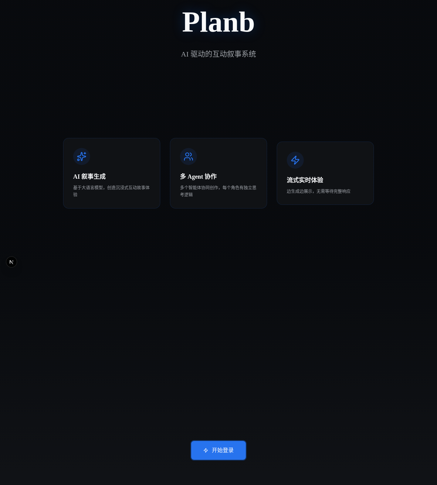
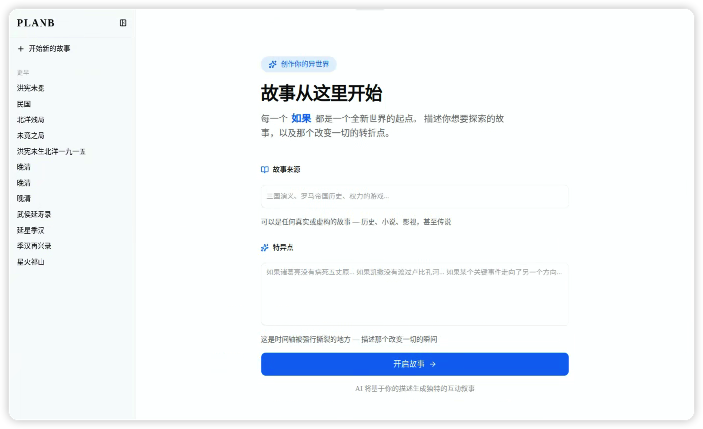
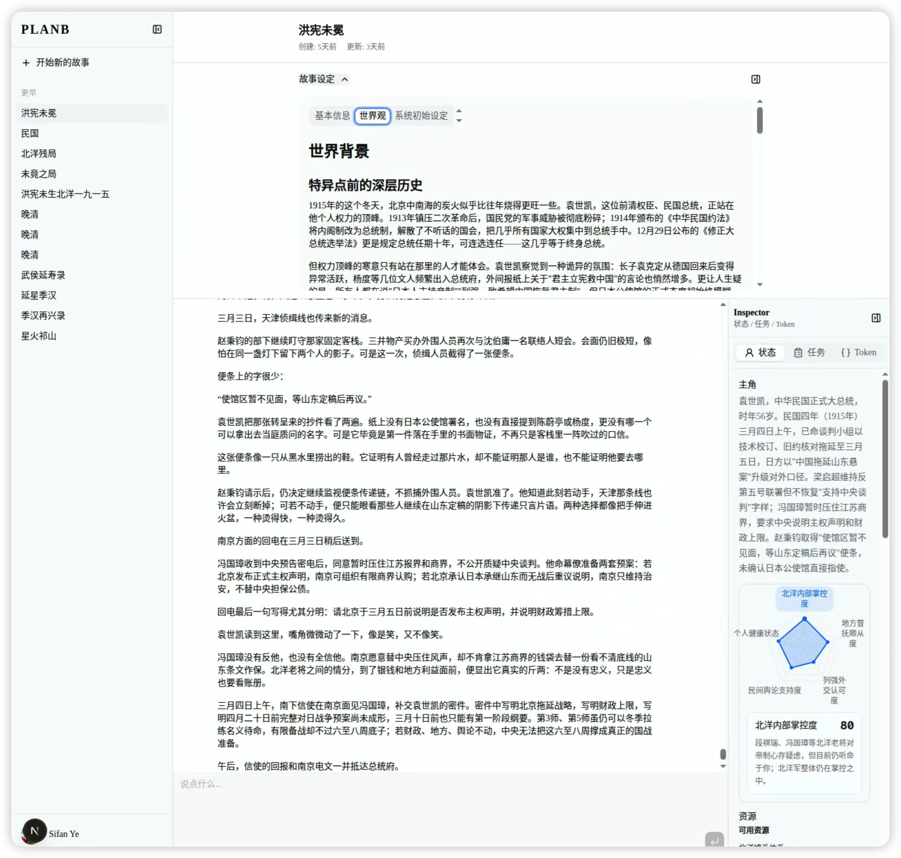
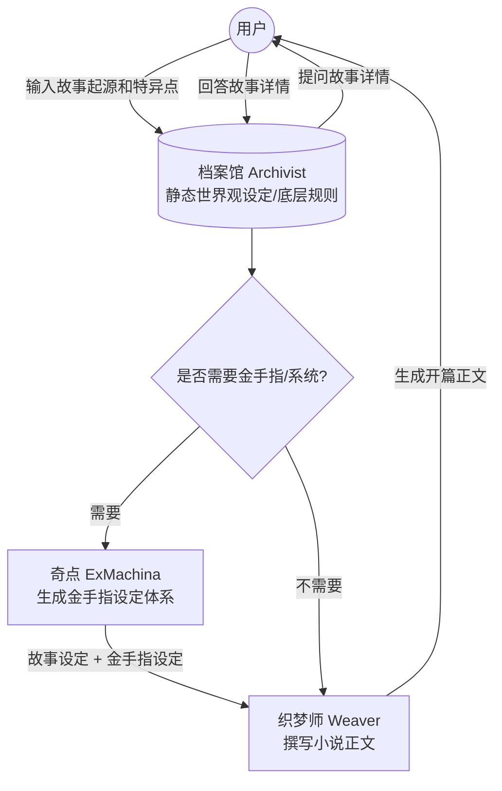
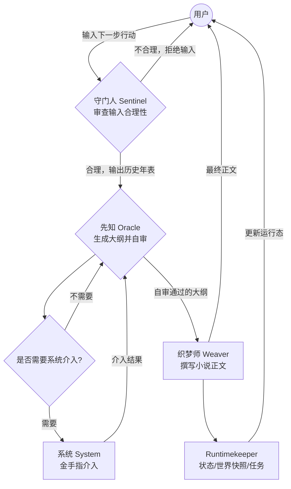

# Planb

[English](./README.md)

Planb 是一个 AI 驱动的互动叙事系统。它把 Fullstack Next.js 应用、Markdown 配置化 Agent、Vercel AI SDK 流式生成和 SQLite 持久化组合在一起，让用户从「故事起源」和「特异点」出发，持续生成带状态、任务和世界快照的互动小说。

> 当前状态：活跃原型，使用 MIT License 开源。

## 核心特性

- **多 Agent 协作编排**：Archivist、Sentinel、Oracle、Weaver、ExMachina、System、Runtimekeeper 分别负责设定、审查、大纲、正文、金手指、系统介入和运行态更新。
- **Markdown 配置化 Agent**：所有 Agent 定义集中在 `planb/agents/*.md`，便于审查、迭代和版本管理。
- **AI 流式生成**：基于 Vercel AI SDK 6，支持 tool calling 和 turn 内共享上下文。
- **互动叙事工作台**：包含创建故事表单、引导问题、聊天式续写、Markdown 渲染和输入区。
- **运行态 Inspector**：右侧栏展示主角五维、世界快照、任务看板和 Token 统计。
- **GitHub OAuth 登录**：使用 Better Auth、Drizzle ORM 和 SQLite。
- **Bun-first 工程栈**：Bun、Next.js 16、React 19、Tailwind CSS v4、shadcn/ui。

## 运行截图

| 首页                                  | 创建故事                                              |
| ------------------------------------- | ----------------------------------------------------- |
|  |  |

| 故事工作台                                            |
| ----------------------------------------------------- |
|  |

## 上手指南

### 前置要求

- [Bun](https://bun.sh/) 1.x+
- GitHub OAuth 应用
- OpenAI-compatible LLM 服务，或其他已在配置中接入的 AI SDK provider

### 安装依赖

```bash
bun install
```

### 配置环境变量

```bash
cp .env.example .env
```

填写 `.env`：

| 变量                   | 说明                                                         |
| ---------------------- | ------------------------------------------------------------ |
| `DB_FILE_NAME`         | SQLite 数据库文件路径，例如 `planb.sqlite`。                 |
| `PLANB_SETTINGS_PATH`  | Planb LLM 配置文件路径，通常是 `planb.yml`。                 |
| `HOST`                 | Better Auth 回调用的应用地址，例如 `http://localhost:3000`。 |
| `BETTER_AUTH_SECRET`   | Better Auth 密钥，请使用强随机值。                           |
| `GITHUB_CLIENT_ID`     | GitHub OAuth Client ID。                                     |
| `GITHUB_CLIENT_SECRET` | GitHub OAuth Client Secret。                                 |
| `LOG_LEVEL`            | 日志级别，例如 `debug` 或 `info`。                           |
| `LLM_AGENT_LOG_DETAIL` | Agent 日志粒度：`summary` 或 `full`。                        |

不要提交真实 `.env`。

### 配置 LLM Provider

```bash
cp planb.example.yml planb.yml
```

`planb.yml` 控制 Agent runtime 可以使用哪些 LLM provider 和模型。配置文件路径由 `PLANB_SETTINGS_PATH` 控制，默认读取 `planb.yml`。

最小可用配置：

```yaml
primaryModel: "myprovider/my-model-name"
secondaryModel: "myprovider/my-fast-model"
provider:
  myprovider:
    npm: "@ai-sdk/openai-compatible"
    name: My AI Provider
    options:
      apiKey: "replace-with-your-key"
      baseURL: "https://api.myprovider.com/v1"
    models:
      my-model-name:
        name: My Model Display Name
```

关键规则：

- `primaryModel` 是主力模型；Agent frontmatter 写 `model: primary` 或不写模型时使用它。
- `secondaryModel` 是可选的二级模型；Agent frontmatter 写 `model: secondary` 时使用它。
- 模型 ID 必须使用 `providerKey/modelName` 格式；`providerKey` 对应 `provider` 字典的 key，`modelName` 对应 `provider.<key>.models` 下的 key。
- `provider.<key>.name` 是日志、错误信息和 OpenAI-compatible adapter 使用的展示名。
- `provider.<key>.options.apiKey` 存放 provider API key。不要提交真实 key。
- `provider.<key>.options.baseURL` 只对 `@ai-sdk/openai-compatible` 生效；`@ai-sdk/deepseek` 使用 DeepSeek 官方默认端点。
- `provider.<key>.models` 是该 provider 可用模型的白名单。

当前支持的 provider package：

| `npm` 值 | Package | 用途 |
| --- | --- | --- |
| `@ai-sdk/openai-compatible` | `@ai-sdk/openai-compatible` | 推荐用于 OpenAI-compatible 端点：OpenAI、OpenRouter、SiliconFlow、Together、Groq、vLLM、Ollama `/v1`、火山方舟等。 |
| `@ai-sdk/deepseek` | `@ai-sdk/deepseek` | DeepSeek 官方 provider，支持 DeepSeek 专属 reasoning 选项。 |
| `ai/test` | `ai` | 测试用 mock provider；适合本地测试和 CI，不需要真实 API key。 |

其他原生 AI SDK provider，例如 `@ai-sdk/anthropic`、`@ai-sdk/google`、`@ai-sdk/openai`、`@ai-sdk/xai`、`@ai-sdk/mistral`，当前还没有启用。若要新增，需要安装对应 package，更新 `lib/llm/type.ts` 的 provider 白名单，在 `lib/llm/provider.ts` 增加分发分支，并按需在 `lib/llm/agent.ts` 接入 provider 专属 reasoning 选项。

OpenAI-compatible 示例：

```yaml
primaryModel: "openai/gpt-4o"
secondaryModel: "openai/gpt-4o-mini"
provider:
  openai:
    npm: "@ai-sdk/openai-compatible"
    name: OpenAI
    options:
      apiKey: "replace-with-your-key"
      baseURL: "https://api.openai.com/v1"
    models:
      gpt-4o:
        name: GPT-4o
      gpt-4o-mini:
        name: GPT-4o Mini
```

DeepSeek 示例：

```yaml
primaryModel: "deepseek/deepseek-chat"
secondaryModel: "deepseek/deepseek-reasoner"
provider:
  deepseek:
    npm: "@ai-sdk/deepseek"
    name: DeepSeek
    options:
      apiKey: "replace-with-your-key"
    models:
      deepseek-chat:
        name: DeepSeek Chat
      deepseek-reasoner:
        name: DeepSeek Reasoner
```

高级用法：

- Agent frontmatter 可以绕过 `primaryModel` / `secondaryModel`，直接写完整模型 ID，例如 `model: "openai/gpt-4o"`。
- YAML 会在服务启动时同步读取并校验。YAML 格式错误、未知 `npm` 值、provider key 不存在或模型名不存在，都会让服务在启动阶段直接报配置错误。
- API key 放在 `planb.yml`；应用和鉴权配置放在 `.env`。

### 初始化数据库

```bash
bun run db:migrate
```

### 本地运行

```bash
bun run dev
```

打开 [http://localhost:3000](http://localhost:3000)。通过 GitHub 登录后会进入 `/story`。

## 架构概览

Planb 主要有两条 Agent 编排链路：创建故事和继续故事。

### 创建流程



### 主流程



## 开发命令

```bash
bun run dev          # 启动 Next.js 开发服务器
bun run build        # 生产构建
bun run start        # 启动生产服务器
bun run db:generate  # 生成 Drizzle migration
bun run db:migrate   # 通过 Bun 运行 SQLite migration
bun lint --fix       # lint 并自动修复
bunx tsc --noEmit    # TypeScript 检查
```

测试使用 `bun:test`，测试文件与源码同目录，命名为 `*.test.ts`。

## 项目结构

| 路径            | 说明                                                  |
| --------------- | ----------------------------------------------------- |
| `app/`          | Next.js App Router 页面、布局、鉴权路由和故事路由。   |
| `components/`   | 产品组件、shadcn/ui 组件和 AI UI elements。           |
| `lib/actions/`  | 创建故事、继续故事等 Server Actions。                 |
| `lib/llm/`      | Agent 工厂、编排辅助函数、tools 和 token usage 统计。 |
| `lib/db/`       | Drizzle schema 和数据库辅助逻辑。                     |
| `planb/agents/` | Markdown Agent 定义和 system prompt。                 |
| `drizzle/`      | 数据库迁移记录。                                      |
| `docs/images/`  | README 截图。                                         |
| `openspec/`     | 能力规格和已归档 change。                             |

## 相关文档

- [`AGENTS.md`](./AGENTS.md)：工程规则和协作流程。
- [`PRODUCT.md`](./PRODUCT.md)：产品定位和设计原则。
- [`DESIGN.md`](./DESIGN.md)：视觉 token 和设计系统说明。
- [`planb/README.md`](./planb/README.md)：Agent 矩阵和原始编排图。
- [`TODO.md`](./TODO.md)：功能清单和实现记录。

## License

Planb 使用 [MIT License](./LICENSE) 开源。
