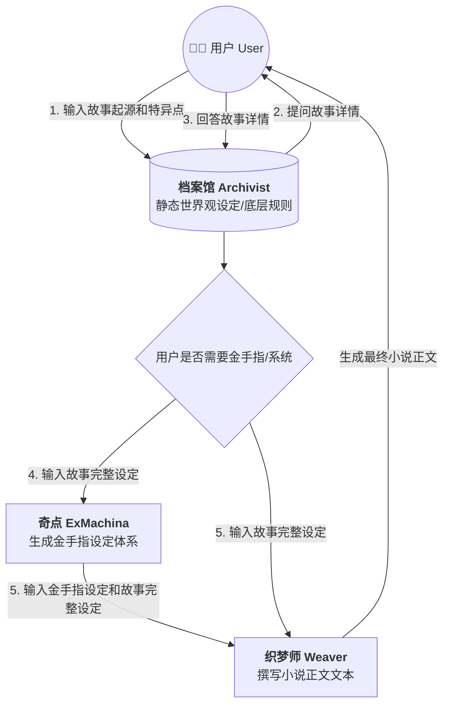
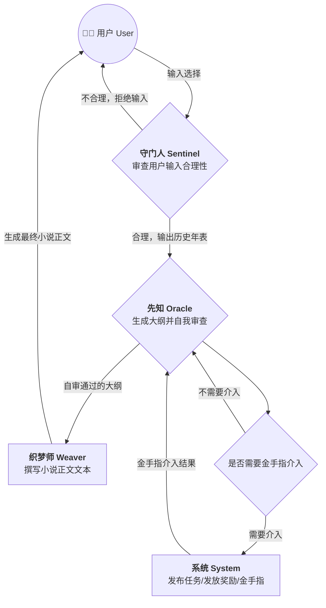

# AGENT 编排

构建一个多 Agent 协作的互动叙事系统。

### 🎭 Agent 核心矩阵 (Agent Roster)

**1. 设定检索官 —— 档案馆 (Archivist)**

- **职责：** 查询故事背景
- **功能：** 负责存储和检索世界观、魔法/科技体系、历史背景、地理环境等静态或低频更新的设定，确保剧情不会"吃书"。
  **2. 输入守门人 —— 守门人 (Sentinel)**
- **职责：** 审查用户输入的合理性。
- **功能：** 作为用户输入的第一道关卡，审查玩家行为是否符合世界设定。通过 judgeInput 工具对每次输入给出 approve（输出历史年表）或 reject（说明拒绝原因）的明确判定。
  **3. 剧情推演官 —— 先知 (Oracle)**
- **职责：** 生成剧情发展大纲，并在最终输出前完成自我审查。
- **功能：** 接收当前剧情状态和用户意图，处理必要骰子与系统介入，生成历史年表式剧情大纲。输出前内置 Arbiter 的核心审查清单，检查世界逻辑、人物行为、因果链、时间线、骰子判定、暗线推进和决策岔口。
  **4. 逻辑审查模板 —— 裁决者 (Arbiter)**
- **职责：** 提供可复用的大纲审查标准。
- **功能：** 保留为精简审查模板；主流程不再调度独立 Arbiter，Oracle 在内部执行同等自审。
  **5. 执笔生成官 —— 织梦师 (Weaver)**
- **职责：** 根据确定的剧情发展生成具体的正文。
- **功能：** 负责最终的文本渲染。将大纲级别的分支剧情，扩写为充满细节、对话、环境描写的具体小说文本，并负责控制行文的语气和风格。
  **6. 超维架构官 —— 奇点 (ExMachina)**
- **职责：** 生成金手指的完整设定体系。
- **功能：** 在故事创建阶段，根据世界观和用户需求，设计金手指的本源、能力体系、任务系统、奖励机制等完整设定。金手指不是凭空出现的，它必须嵌入世界的底层规则中，有其存在的必然性和合理性。
  **7. 超维系统官 —— 系统 (System)**
- **职责：** 扮演小说中的"金手指"。
- **功能：** 在主流程中根据 ExMachina 生成的设定，扮演金手指角色介入故事。它可以发布"系统任务"，提供"隐藏选项"，在关键时刻发放"系统奖励"，或发出警告。通过编排层将强制变量注入后续 Agent 的上下文来改变故事走向。

---

### ⚙️ 多 Agent 调度与交互流 (Architecture Diagram)

#### 创建流程

#### 主流程

