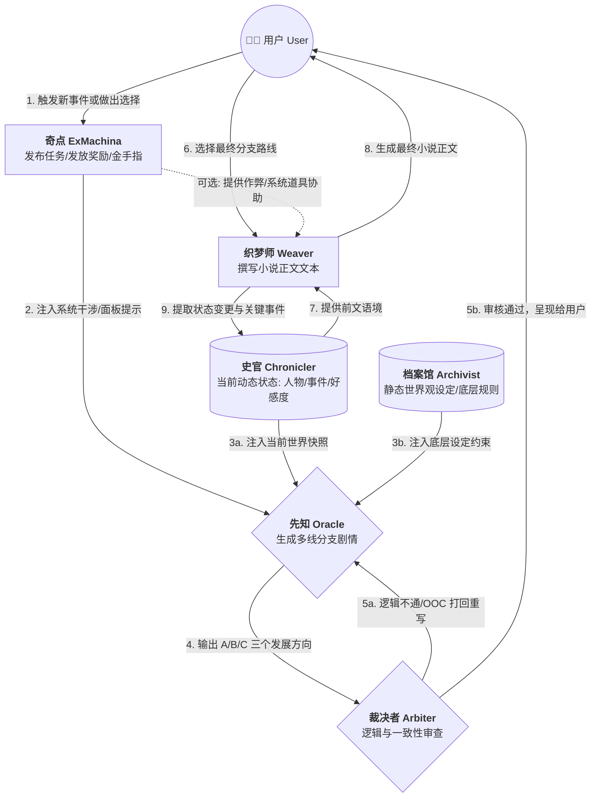

# AGENT 编排

构建一个多 Agent 协作的互动叙事系统。

### 🎭 Agent 核心矩阵 (Agent Roster)

**1. 设定检索官 —— 档案馆 (Archivist)**

- **职责：** 查询故事背景
- **功能：** 负责存储和检索世界观、魔法/科技体系、历史背景、地理环境等静态或低频更新的设定，确保剧情不会“吃书”。

**2. 剧情推演官 —— 先知 (Oracle)**

- **职责：** 生成多个剧情发展分支。
- **功能：** 接收当前剧情状态和用户意图，进行发散性思考，生成 A/B/C 等多条走向不同的剧情分支。它是整个系统的“创意引擎”。

**3. 逻辑审查官 —— 裁决者 (Arbiter)**

- **职责：** 评审剧情发展是否合理。
- **功能：** 作为约束条件检查器（Constraint Checker）。它会拿着 **先知 (Oracle)** 生成的分支，去和 **档案馆 (Archivist)** 的底层设定以及当前的状态进行交叉比对。如果发现逻辑漏洞、战力崩坏或性格OOC（Out of Character），则打回重做。

**4. 执笔生成官 —— 织梦师 (Weaver)**

- **职责：** 根据确定的剧情发展生成具体的正文。
- **功能：** 负责最终的文本渲染。将大纲级别的分支剧情，扩写为充满细节、对话、环境描写的具体小说文本，并负责控制行文的语气和风格。

**5. 纪元记录官 —— 史官 (Chronicler)**

- **职责：** 纪录故事进展，总结世界概略、人物和事件状态。
- **功能：** 系统的“动态内存”和状态机（State Machine）。每次新剧情生成后，它负责提取关键信息（谁获得了什么道具、谁和谁结仇了、时间推移了多久），并更新当前的世界快照（World Snapshot）。

**6. 超维系统官 —— 奇点 (ExMachina / The System)**

- **职责：** 扮演小说中的“金手指”或“系统”。
- **功能：** 这是一个高权限的干涉型 Agent。它可以打破常规逻辑，向用户发布“系统任务”，提供“隐藏选项”，或者在关键时刻发放“系统奖励”。它通过向其他 Agent 注入强制变量来改变故事走向。

---

### ⚙️ 多 Agent 调度与交互流 (Architecture Diagram)

下面是这些 Agent 之间的协同工作流。你可以将这段代码复制到任何支持 Mermaid 的 Markdown 编辑器（如 GitHub, Obsidian 等）中查看可视化图形。

### 🔄 核心调度逻辑解析

1.  **环境初始化与干涉：** 用户做出前置选择后，首先唤醒 **奇点 (ExMachina)**。它会判断当前情境下是否需要触发“系统任务”（例如：“叮！检测到宿主面临生死危机，发布临时任务...”）。
2.  **上下文组装：** **先知 (Oracle)** 在开始推演前，必须同时拉取 **史官 (Chronicler)** 提供的最新动态数据（昨天发生了什么，主角现在几级）以及 **档案馆 (Archivist)** 的静态设定。
3.  **对抗生成与审查（Agentic Workflow 的核心）：** **先知 (Oracle)** 生成多个方案后，不直接给用户，而是先交给 **裁决者 (Arbiter)** 进行内部对抗审查（Self-Correction）。这能极大程度避免 AI 常见的“胡编乱造（Hallucination）”问题。
4.  **文本渲染与状态闭环：** 用户选定分支后，**织梦师 (Weaver)** 进行详细描写。写完后，这是一个关键的工程步骤： **史官 (Chronicler)** 需要根据故事发展更新世界数据库，完成整个闭环。

---
