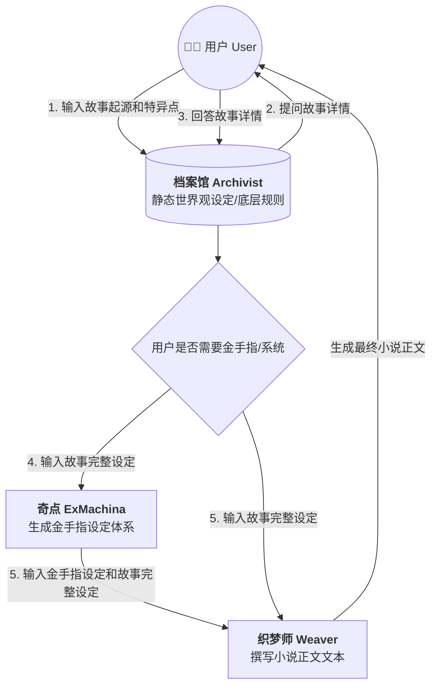
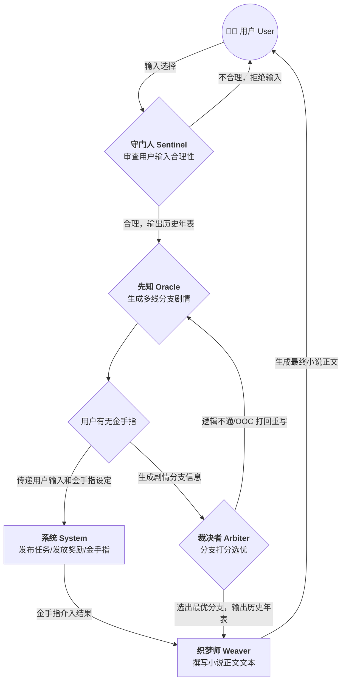

# AGENT 编排

构建一个多 Agent 协作的互动叙事系统。

### 🎭 Agent 核心矩阵 (Agent Roster)

**1. 设定检索官 —— 档案馆 (Archivist)**

- **职责：** 查询故事背景
- **功能：** 负责存储和检索世界观、魔法/科技体系、历史背景、地理环境等静态或低频更新的设定，确保剧情不会"吃书"。
  **2. 输入守门人 —— 守门人 (Sentinel)**
- **职责：** 审查用户输入的合理性。
- **功能：** 作为用户输入的第一道关卡，审查玩家行为是否符合世界设定。合理输入转化为历史年表输出；不合理输入调用 rejectInput 拒绝并提示可行方向。
  **3. 剧情推演官 —— 先知 (Oracle)**
- **职责：** 生成多个剧情发展分支。
- **功能：** 接收当前剧情状态和用户意图，进行发散性思考，生成 A/B/C 等多条走向不同的剧情分支。它是整个系统的"创意引擎"。
  **4. 逻辑审查官 —— 裁决者 (Arbiter)**
- **职责：** 审查 Oracle 剧情分支，打分选优。
- **功能：** 对 Oracle 生成的分支进行逻辑审查，淘汰不合理分支，对通过审查的分支按因果力度、戏剧张力、角色活性、暗线纵深、抉择分量五维度打分，选择综合得分最高的分支输出。可做合理化微调，逻辑不通则打回重写。统一输出历史年表格式。
  **4. 执笔生成官 —— 织梦师 (Weaver)**
- **职责：** 根据确定的剧情发展生成具体的正文。
- **功能：** 负责最终的文本渲染。将大纲级别的分支剧情，扩写为充满细节、对话、环境描写的具体小说文本，并负责控制行文的语气和风格。
  **5. 超维架构官 —— 奇点 (ExMachina)**
- **职责：** 生成金手指的完整设定体系。
- **功能：** 在故事创建阶段，根据世界观和用户需求，设计金手指的本源、能力体系、任务系统、奖励机制等完整设定。金手指不是凭空出现的，它必须嵌入世界的底层规则中，有其存在的必然性和合理性。
  **6. 超维系统官 —— 系统 (System)**
- **职责：** 扮演小说中的"金手指"。
- **功能：** 在主流程中根据 ExMachina 生成的设定，扮演金手指角色介入故事。它可以发布"系统任务"，提供"隐藏选项"，在关键时刻发放"系统奖励"，或发出警告。通过编排层将强制变量注入后续 Agent 的上下文来改变故事走向。

---

### ⚙️ 多 Agent 调度与交互流 (Architecture Diagram)

#### 创建流程

#### 主流程

